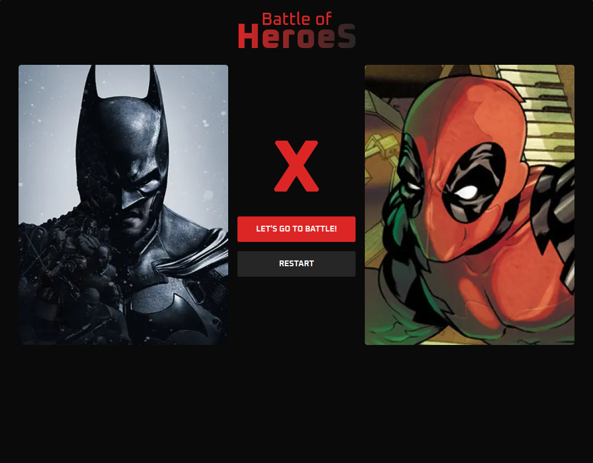

<!-- CABEÇALHO -->
<div id="readme-top" align="center">
    <h1>
        🦸 Battle of Heroes 🦸
    </h1>
    <p>
        <a href="#%EF%B8%8F-sobre-o-projeto">Sobre o Projeto</a> •
        <a href="#-funcionalidades">Funcionalidades</a> •
        <a href="#%EF%B8%8F-instalação">Instalação</a> •
        <a href="#%EF%B8%8F-tecnologias">Tecnologias</a> •
        <a href="#-autor">Autor</a>
    </p>
</div>

<div align="center">
       
</div>

<!-- SOBRE O PROJETO -->

## 🖥️ Sobre o Projeto

<!-- <div align="center">
    <a href="http://marcos-kuribayashi.vercel.app/">
        
    </a>
</div> -->

Este projeto é uma aplicação web de um jogo de batalha de heróis.

A aplicação exibe uma lista de heróis que pode ser filtrada de acordo com o nome pesquisado. O usuário então escolhe dois personagens para uma batalha. O vencedor do combate será o personagem com a maior soma dos valores de cada poder que possui.

<!-- FUNCIONALIDADES -->

## 💡 Funcionalidades

- [x] Listagem de heróis
- [x] Filtragem de heróis
- [x] Sistema de combate

<!-- INSTALAÇÃO -->

## ⚙️ Instalação

> Esse é um projeto Next.js inicializado com `create-next-app`

- Faça o fork desse repositório

- Abra o terminal e clone o repositório:

```Bash
$ git clone git@github.com:<your_user>/battle-of-heroes.git
```

- Entre no diretório do projeto:

```Bash
$ cd battle-of-heroes/
```

- Instale as dependências:

```Bash
$ npm install
# or
$ yarn install
```

- Execute o servidor de desenvolvimento:

```Bash
$ npm run dev
# or
$ yarn dev
```

Pronto! A aplicação, agora, pode ser acessada em um navegador através da url https://localhost:3000/.

<!-- TECNOLOGIAS -->

## 🛠️ Tecnologias

Para o desenvolvimento desse projeto, as seguintes ferramentas foram utilizadas:

- **[React.js](https://pt-br.reactjs.org/)**
- **[Next.js](https://nextjs.org/)**
- **[TypeScript](https://www.typescriptlang.org/)**
- **[Zustand](https://zustand-demo.pmnd.rs/)**
- **[Tailwind](https://tailwindcss.com/)**
- **[Shadcn UI](https://ui.shadcn.com/)**
- **[Radix UI](https://www.radix-ui.com/)**
- **[React Query](https://tanstack.com/query/latest/)**
- **[React Hook Form](https://react-hook-form.com/)**
- **[Zod](https://zod.dev/)**

## 👨‍💻 Autor


Marcos Kenji Kuribayashi

[](https://www.linkedin.com/in/marcos-kuribayashi/) [](mailto:marcosken13@gmail.com)

---

Desenvolvido por Marcos Kenji Kuribayashi 😉
